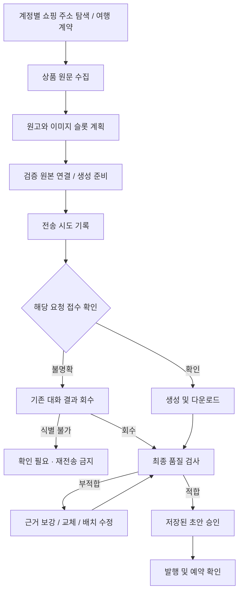

# 소재 준비의 책임과 복구 경계

## 지켜야 하는 조건

- 계정 연결: 쇼핑 공간 ID를 다른 계정의 기본값으로 대체하지 않는다. 여행 계약은 독립적으로 유지한다.
- 상품 수집: 원문 근거 부족을 원고 재작성으로 해결하지 않는다. 브라우저 종료는 사용자 중지일 수 있으므로 무조건 다시 열지 않는다.
- 이미지 전송: 전송 전 일시 오류만 한 번 자동 재시도한다. 전송 버튼 호출 직전에 시도 기록을 저장하고, 이후 불확실한 오류는 재전송하지 않는다.
- 접수: 입력창이나 assistant 응답이 아니라 해당 프롬프트와 일치하는 새로운 user 메시지를 확인한다.
- 복구: 일반 대화와 Custom GPT 대화 경로를 보존한다. 이미 전송한 요청은 기존 대화에서 결과만 회수한다. 대화가 식별되지 않으면 명시적인 확인 필요 상태를 유지한다.
- 품질: 이미지 원본/제품 동일성, 기능 근거, 기하 규격, 원고 품질 기준은 전송 오류 복구와 독립적이다. 재시도 성공은 승인 성공이 아니다.
- 발행: 저장된 승인 상태와 최종 검사를 확인한다. 예약 응답이 불명확하면 재발행하지 않는다.

## 소유 모듈

| 책임 | 정본 |
|---|---|
| 쇼핑 주소 탐색, URL 검증, 401/403 구분 | `src/lib/shopping-connect-access.ts` |
| 접수 관찰 | `scripts/lib/chatgpt-browser.ts` |
| 요청 기록, 대화 회수, 제한된 재시도, 안전한 오류 코드 | `scripts/chatgpt-generate-image-batch.ts` |
| 원본 연결 | `src/lib/brand-post-image-generation.ts` |
| 픽셀 품질 검사 | `scripts/lib/publish-image-audit.ts` |
| 단계별 복구 및 승인 | `scripts/lib/scheduled-draft-workflow.ts` |

새 PC의 목록 조회와 CLI 자동등록 모두 같은 쇼핑 주소 탐색기를 사용한다. 명시적으로 설정한 주소는 유지하고, 설정이 없으면 현재 로그인 계정 API가 반환한 공간 ID와 카테고리 ID를 사용한다. 상품이 실제로 조회되는 카테고리를 우선하고, API 연결이 불가능할 때만 SSO와 화면 링크 탐색으로 내려간다. 여러 공간이 있으면 임의 선택하지 않는다. 401은 재로그인, 403은 권한/공간 확인으로 구분한다.

오류 진단에는 단계, 경과시간, 허용된 원인 코드만 저장한다. 프롬프트, 이메일, 토큰, 전체 DOM 및 원시 예외는 진단 파일에 추가하지 않는다.

## 변경 검증

`npm run test:material-regression`은 쇼핑/여행 라우팅, 전송/복구, 원본·픽셀 검수, 승인, 예약을 함께 검사하고 첫 실패에서 종료한다. `npm run typecheck`와 `npm run build`도 통과해야 배포 후보로 삼는다.

오프라인 통과는 다른 PC의 실계정 접속이나 실제 생성/예약 성공을 증명하지 않는다. 출시 검증에는 해당 PC의 버전, 계정별 공간 접근, 대화 접수/결과 회수, 저장된 승인 상태를 별도로 확인한다. 임계값을 낮추거나 결과 미확인 항목을 성공으로 바꾸는 방식으로 통과시키지 않는다.

## 2026-09-22 실환경 관찰

현재 PC의 저장 세션으로 브랜드커넥트 홈을 열면 `/about` 소개 페이지가 반환됐고, 서버 렌더링 계정 상태는 `loginId=null`, `spaces=null`이었다. 반면 공식 웹앱의 계정 조회 경로는 `/brand-connect/query/me`이며, 공간 정보는 `space`, `activeSpaceIds`, `spaces`로 제공되는 것을 확인했다. v1.3.78은 새 로그인 직후 공식 SSO를 완료해 세션을 다시 저장하고, 이 계정 응답과 `base-display-categories` 응답으로 카테고리 주소를 정한다. 현재 PC의 기존 세션은 SSO에서 네이버 로그인 화면으로 돌아가므로 `NAVER_SESSION_EXPIRED`로 판정됐다. 다른 PC의 실제 로그인 후 상품 조회 성공은 해당 PC에서 다시 확인해야 한다.
