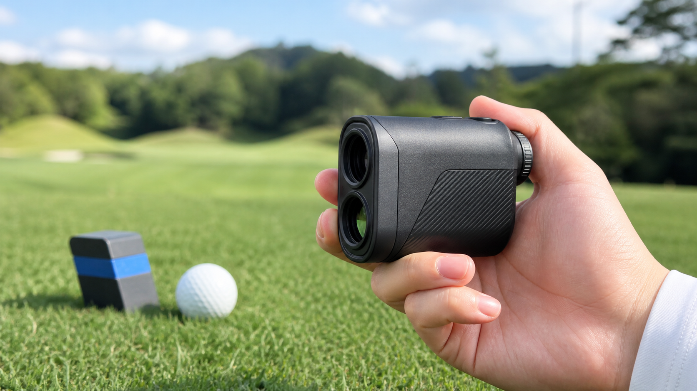
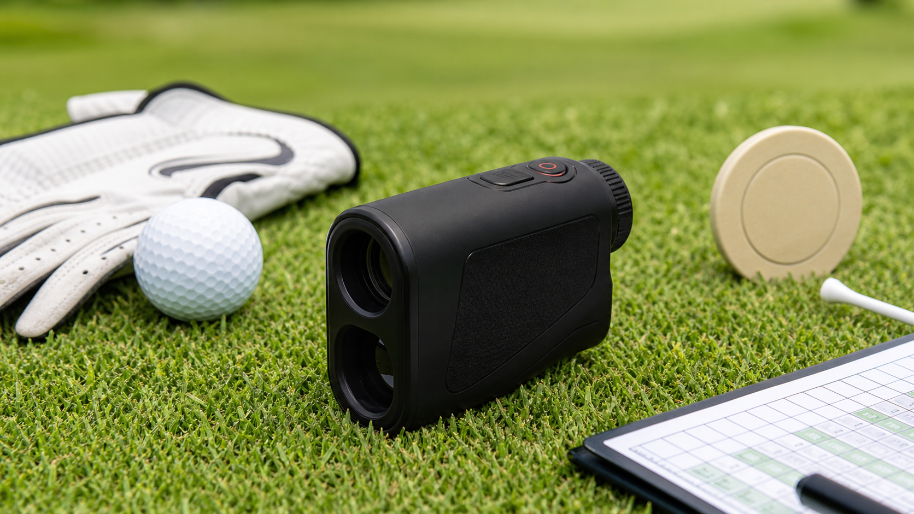
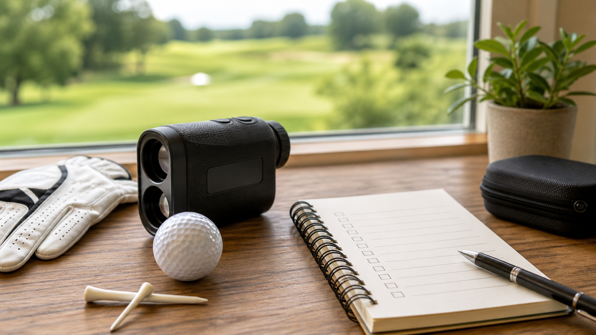

# 파인캐디 UPL2000 에이밍 골프거리측정기 사용 기준과 구매 전 체크

이 포스팅은 네이버 쇼핑 커넥트 활동의 일환으로, 판매 발생 시 수수료를 제공받습니다.

라운드를 하다 보면 남은 거리가 애매하게 느껴지는 순간이 생각보다 자주 옵니다. 파3 티샷처럼 클럽을 바로 골라야 할 때도 그렇고, 세컨드샷에서 그린 앞쪽까지 얼마나 남았는지 보고 싶을 때도 그렇습니다.

그럴 때 골프거리측정기가 있으면 감으로만 판단하지 않고 한 번 더 기준을 잡을 수 있습니다. 오늘은 파인캐디 UPL2000 에이밍 골프거리측정기를 보면서, 라운드에서 어떤 식으로 활용하면 좋을지와 구매 전에 확인할 부분을 정리해보겠습니다.

## 파인캐디 UPL2000에서 먼저 보게 되는 부분

파인캐디 UPL2000은 이름에서부터 에이밍과 고투과 LCD가 먼저 눈에 들어옵니다. 거리측정기를 고를 때는 숫자로 된 스펙도 중요하지만, 실제 필드에서 화면이 보기 편한지, 목표 지점을 잡을 때 조작이 복잡하지 않은지도 같이 봐야 합니다.

특히 햇빛이 강한 날에는 화면 가독성이 체감에 영향을 줄 수 있습니다. 다만 밝기, 측정 범위, 무게, 배터리 같은 세부 수치는 판매 상세페이지에 있는 공식 정보를 기준으로 다시 확인하는 편이 좋습니다.

## 라운드에서는 이렇게 쓰게 됩니다

거리측정기를 가장 자주 꺼내는 순간은 티박스나 페어웨이에서 핀까지의 거리를 확인할 때입니다. 파3 홀에서는 핀까지 거리를 보고 평소 캐리 거리와 맞춰보게 되고, 파4나 파5에서는 세컨드샷을 남겨둔 위치에서 그린 앞뒤 거리까지 함께 생각하게 됩니다.

물론 거리 하나만 보고 클럽을 고르면 아쉬울 때가 있습니다. 앞바람, 오르막, 내리막, 라이 상태까지 같이 봐야 하니까요. 그래서 거리측정기는 정답을 대신 골라주는 장비라기보다, 내 판단을 도와주는 기준점에 가깝습니다.

## 좋게 볼 만한 포인트

먼저 용도가 분명합니다. 라운드 중 거리를 빠르게 확인하고 싶은 분, 클럽별 거리 감각을 잡아가는 초보 골퍼, 기존에 쓰던 거리측정기를 바꿔볼까 고민하는 분에게 맞는 제품군입니다.

또 하나는 보상판매 모델이라는 점입니다. 이미 거리측정기를 가지고 있는 분이라면 새 제품을 그냥 사는 것보다 보상판매 조건을 먼저 보게 되죠. 이럴 때는 가격만 볼 게 아니라 내가 자주 치는 코스에서 들고 다니기 편한지, 버튼 조작이 익숙할지, 화면을 보는 방식이 나에게 맞을지까지 같이 보는 게 좋습니다.

## 아쉬운 점과 주의할 부분

골프거리측정기는 필드 환경에 따라 체감이 달라질 수 있습니다. 손떨림, 날씨, 빛 반사, 목표물 위치에 따라 측정 경험이 달라질 수 있으니 한 번 찍고 끝내기보다 목표 지점을 다시 잡아보거나 코스 상황과 함께 보는 습관이 필요합니다.

또한 구매 전에는 구성품, AS 기준, 보상판매 적용 조건, 배송 조건을 꼭 확인하는 것이 좋습니다. 이벤트나 보상판매 조건은 시점에 따라 달라질 수 있으니 결제 전 판매 페이지에서 한 번 더 확인해보세요.

## 이런 분께 추천

파인캐디 UPL2000 에이밍 골프거리측정기는 아래 상황에 해당하는 분들이 먼저 살펴볼 만합니다.

- 라운드 중 남은 거리를 빠르게 확인하고 싶은 골퍼
- 노캐디나 셀프 라운드에서 거리 판단 기준이 필요한 분
- 기존 거리측정기를 교체하면서 보상판매 조건을 확인하려는 분
- 입문 후 클럽별 캐리 거리 감각을 잡고 싶은 초보 골퍼
- 골프 선물로 휴대형 필드 장비를 찾는 분

특히 초보 골퍼라면 남은 거리를 확인하는 습관 자체가 클럽 선택 연습에 도움이 됩니다. 다만 거리측정기가 스코어 향상을 보장하는 장비는 아니므로, 본인의 스윙 거리와 코스 매니지먼트와 함께 쓰는 보조 도구로 보는 것이 좋습니다.

## 구매 전 체크리스트

- 제품명과 모델명: 파인캐디 UPL2000 에이밍 골프거리측정기인지 확인
- 화면 확인: 고투과 LCD 안내와 실제 화면 관련 상세 스펙 확인
- 사용성: 한 손 조작, 버튼 위치, 휴대 방식 확인
- 구성품: 케이스, 스트랩, 설명서 등 실제 제공 구성 확인
- 보상판매: 적용 대상, 기간, 조건 확인
- 가격과 이벤트: 표시 가격, 쿠폰, 프로모션 적용 조건 확인
- AS와 배송: 공식 판매처 기준으로 확인
- 교환/반품: 개봉 후 교환 가능 여부와 왕복 배송비 조건 확인
- 실제 이미지: 판매페이지의 제품 색상, 외형, 구성품 사진 확인

## 마무리

골프거리측정기를 고를 때는 좋다는 말만 보고 결정하기보다 내가 자주 치는 코스와 라운드 습관에 맞는지 보는 것이 중요합니다. 파인캐디 UPL2000 에이밍 골프거리측정기는 제품명 자체가 분명하고, 사용 장면과 구매 전 체크 포인트를 함께 보기 좋은 모델입니다.

필드에서 쓸 장비를 찾고 있다면 가격이나 이벤트만 보기보다 사용 장면, 휴대감, 구성품, 보상판매 조건을 같이 비교해보세요. 그 과정까지 확인하면 나에게 맞는 골프거리측정기를 고르는 데 훨씬 도움이 됩니다.

제품 확인 링크:

https://naver.me/GFswUlHj

이미지 안내: 본문 이미지는 이해를 돕기 위한 콘셉트 이미지입니다. 실제 제품 외형, 로고, 구성품은 판매페이지의 공식 이미지와 상세 정보를 기준으로 확인해주세요.

#파인캐디 #UPL2000 #골프거리측정기 #에이밍골프거리측정기 #고투과LCD #골프용품 #골프거리측정기추천 #라운드준비 #보상판매 #골프선물

